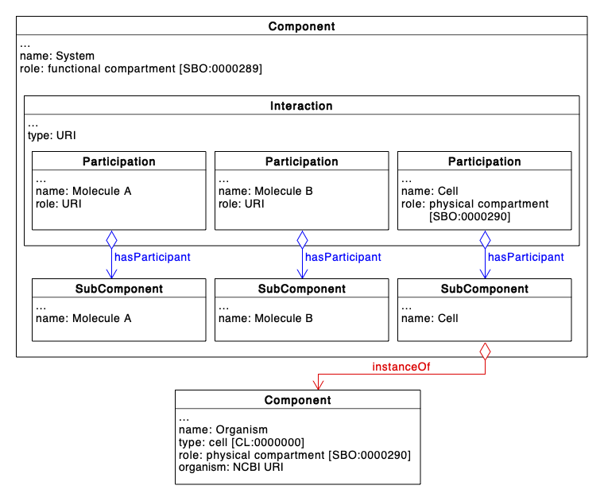
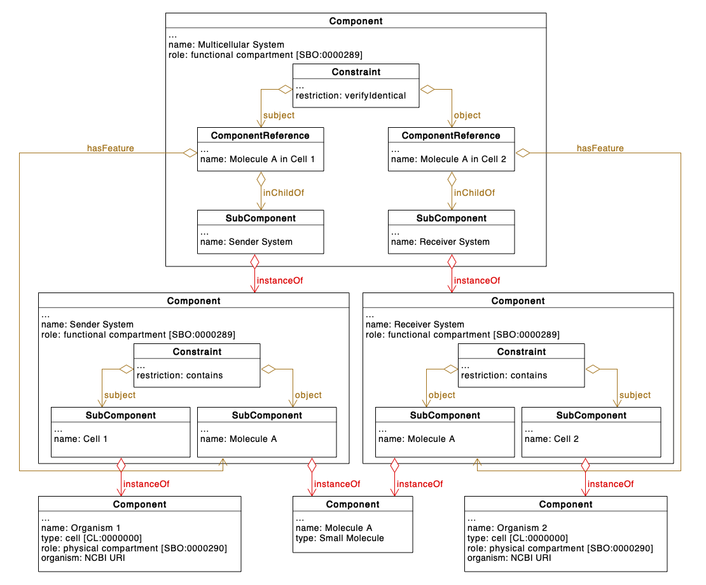

# Multicellular System Designs

SBOL has been used extensively to represent designs in homogeneous
systems, where the same design is implemented in every cell. However,
in recent years there has been increasing interest in multicellular
systems, where biological designs are split across multiple cells to
optimize the system behavior and function. Therefore, there is a need
to define a set of best practices so that multicellular systems can be
captured using SBOL in a standard way.

## Representing Cell Types

To represent multicellular systems using SBOL, it is first necessary
to represent cells. When doing so, it is important to be able to
capture the following information: (i) taxonomy of the strain used,
(ii) interactions occurring within cells of this type, and (iii)
components inside the type of cell (e.g. genomes, plasmids). The
approach RECOMMENDED in this section is capable of capturing this
information, as shown in the example in [Figure 1](#figure-1). It uses a `Component`
to represent a system that contains cells of the given type. The cells
themselves are represented by a `Feature` inside the `Component`, in this
case a `SubComponent` that is an `instanceOf` a `Component` capturing
information about the species and strain of the cell in the
design. This `Component` has a `type` of "cell" from the Gene Ontology
(GO:0005623), and a `role` of "physical compartment"
(SBO:0000290). Taxonomic information is captured by annotating the
class instance with a URI for an entry in the NCBI Taxonomy Database.

As usual, other entities besides the cell that are relevant to the
design are also captured as `Feature`s. When these are contained within
the cell, they are captured using a `Constraint` with restriction
contains with the cell as `subject` and contained object as
`object`. Interactions which occur in this system are captured using the
`Interaction` and `Participation` classes. Interactions which occur within
the cell are specified by `Interaction` classes which contain the
`Feature` instance representing the cell as a `participant` with a `role` of
"physical compartment" (SBO:0000290).

<figure>
   
  <figcaption>
    Figure 1: This is a proposed approach for capturing cell designs in
    SBOL. A <code>Component</code> annotated with a URI pointing to an entry in the
    NCBI Taxonomy Database is used to capture information about the cell’s
    strain/species. The <code>Component</code> has a type of "Cell" from the Gene
    Ontology (GO), and a role of "physical compartment". Another <code>Component</code>
    is used to represent a system in which the cell is
    implemented. Entities, including the cell, are instantiated as
    <code>Feature</code>s, and processes are captured using the <code>Interaction</code>
    class. Processes that are contained within the cell are represented by
    including the cell as a participant with a role of "physical
    compartment".
  </figcaption>
</figure>

## Multiple Cell Types in a Single Design

The same approach can be extended to represent systems with multiple
types of cells. The multicellular system can be represented as a
`Component` that includes each strain of cell as a `Feature`, in this
example a `SubComponent` that is an `instanceOf` a `Component` defining
its strain. Interactions and constraints, such as a molecule that both
strains interact with, are implemented using *ComponentReference*s to
link to the definitions within each cell system description. An
example is shown in [Figure 2](#figure-2).

<figure>
   
  <figcaption>
    Figure 2: Captured here is a design involving two cells which both
    interact with the small molecule "Molecule A". Designs for the
    sender and receiver systems are captured using constraint to show
    that each of these cells interacts with the Molecule A contained
    within it. The overall multicellular system is represented by a
    <code>Component</code> with a <code>role</code> of "functional compartment", which is an SBO
    term. The two systems are included in this multicellular design as
    <code>Feature</code>s, and the fact that Molecule A is shared between systems is
    indicated with a constraint.
  </figcaption>
</figure>

## Cell Ratios

The proportion of cell types present in a multicellular system can be
captured using `om:Measure` on the representations of cells in the
design. As a best practice, the value of these measure classes is a
percentage less than or equal to 100%, representing the amount of a
cell type present in the system compared to all other cell types
present. Therefore, the sum of all these values specified in the
system will typically be equal to 100%, though this may not be the
case if the system is not completely defined. An example is shown in
[Figure 3](#figure-3).

<figure>
   
  <figcaption>Figure 3: Annotating class instances with cellular proportions. Instances of the <code>Measure</code> class are used to capture the percentage of each cell type present in the multicellular system design.
  </figcaption>
</figure>
